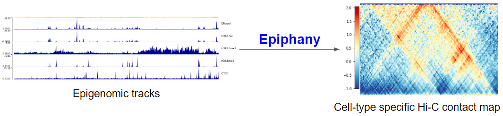

# Epiphany

### **Epiphany: predicting Hi-C contact maps from 1D epigenomic signals**

Epiphany, a neural network to predict cell-type-specific Hi-C contact maps from widely available epigenomic tracks. Epiphany uses bidirectional long short-term memory layers to capture long-range dependencies and optionally a generative adversarial network architecture to encourage contact map realism. Epiphany shows excellent generalization to held-out chromosomes within and across cell types, yields accurate TAD and interaction calls, and predicts structural changes caused by perturbations of epigenomic signals.

## Roadmap
This repo includes scripts and related files for the Epiphany model [[preprint]](https://www.biorxiv.org/content/10.1101/2021.12.02.470663v1).

- [Quick start](#quick-start-training)
- [Data preparation](/data_preparation)
- [Model design and training script](/epiphany)
- [Downstream applications](/downstream)

**Resource repo**: Zenodo [](https://doi.org/10.5281/zenodo.7795868)

- Sample datasets: `GM12878_X.h5` and `GM12878_y.pickle` for input and target sample datasets for Epiphany training
- Pretrained model weights: 
>- `pretrained_10kb.pt_model`: pretrained weights of 10kb model 
>- `pretrained_5kb.pt_model`: pretrained weights of 5kb model


## Quick start training
### Clone Repository
```
git clone https://github.com/arnavmdas/epiphany.git
```

### Training
Move to training directory
```
cd epiphany/epiphany
```

Download dataset from google drive

```
mkdir ./Epiphany_dataset
cd ./Epiphany_dataset
wget --no-check-certificate https://drive.google.com/drive/u/2/folders/1UJX6cp-4s0Jbud9jovzuaqnBeORg5R8x -O GM12878_X.h5
wget --no-check-certificate https://drive.google.com/drive/u/2/folders/1UJX6cp-4s0Jbud9jovzuaqnBeORg5R8x -O GM12878_y.pickle
cd ..
```


Run training script
```
python3 adversarial.py --wandb
```

### Prediction using pretrained models 

- Generate contact map of GM12878 chromosome 3 using pre-trained model at 10kb resolution: [Google colab](https://colab.research.google.com/drive/1DhnboWQvZcltbXKYzHrfm8JSBu9xG4M3?usp=sharing)
- Generate contact map of a certain region on H1ES cell chromosome 8 [chr8:53167500-55167500] with original and perturbed epigenomic signals using pretrained model at 5kb resolution: [Google colab](https://colab.research.google.com/drive/1KjWXWl3OEZXrZGtu-rkG0nw0Odix6syP?authuser=1#scrollTo=opwMnpPFJaC7)